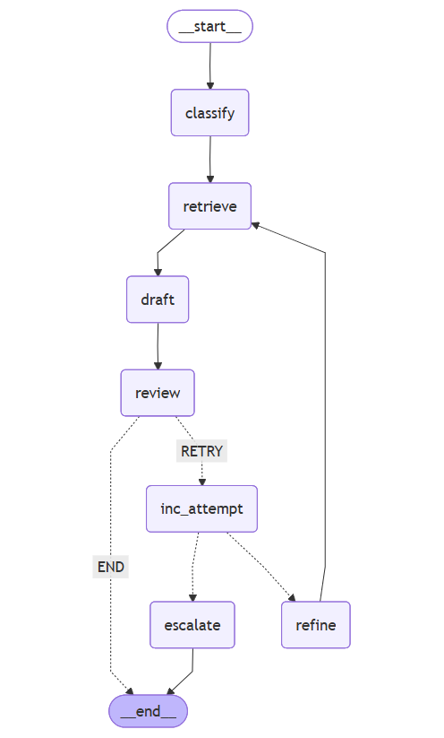

# 🎫 Support Ticket Resolution Agent

An **Agentic RAG** system built with **LangGraph** that classifies support tickets, retrieves relevant knowledge, drafts a reply, and runs a **multi‑step review loop**. If two attempts fail, the ticket is **escalated** for human review.

---

## ✨ Features
- **Classification** → `Technical | Billing | Security | General`
- **RAG retrieval** → FAISS + OpenAI embeddings (falls back to local snippets if no API key)
- **Drafting** → Clear, empathetic, grounded reply
- **Review loop** → Gate on groundedness, policy, tone, actionability
- **Refine + Retry** → Reviewer feedback improves retrieval on the next pass
- **Escalation** → After 2 failed reviews, append to `escalation_log.csv`
- **UI** → Streamlit app to submit tickets and visualize the graph
- **CLI** → `run_local.py` for a one‑shot demo

---

## 🧩 Agent Flow

The following diagram shows the entire pipeline:



> Ensures clarity of the corrective loop and escalation path.

---

## 📂 Project Structure
```
support-ticket-agent/
├── src/
│   ├── graph.py          # LangGraph wiring & routing
│   ├── state.py          # Shared state (schema & helpers)
│   └── nodes/            # classify / retrieve / draft / review / refine / escalate
├── rag_corpus/           # Your markdown/txt knowledge base (per category)
├── rag_index/            # FAISS indexes (generated by rag_ingest)
├── tests/                # pytest: happy, retry, escalate
├── app.py                # Streamlit UI (runs the full agent + Mermaid graph viewer)
├── run_local.py          # CLI demo + optional graph export
├── requirements.txt
└── README.md
```

---

## ⚡ Quickstart

### 1) Setup
```bash
python -m venv .venv
# macOS/Linux
source .venv/bin/activate
# Windows PowerShell
# .venv\Scripts\Activate.ps1

pip install -r requirements.txt
```

Create `.env` and set (if you want FAISS retrieval with embeddings):
```
OPENAI_API_KEY=sk-...
```

### 2) Build RAG indexes
- Add small `.md`/`.txt` files into `rag_corpus/<Category>/`
- Then run:
```bash
python -m src.rag_ingest
```

### 3) Run the demo (CLI)
```bash
python run_local.py
```

### 4) Launch the UI
```bash
streamlit run app.py
```
- Enter **Subject** and **Description**.
- See the **Agent Flow** diagram in docs for the pipeline.

### 5) Tests (optional)
```bash
pytest -q
```

---

## ✅ Example (happy path)
**Subject**: `Password reset not working on mobile`  
**Description**: `User cannot reset password on iOS app.`

Expected output highlights:
- `category`: `Technical`
- `context`: password‑reset + app‑version snippets
- `approved`: `true`
- `attempts`: `0`

---

## 🛠 Notes
- If no `OPENAI_API_KEY` is present, retrieval falls back to a tiny in‑memory corpus so the app still works.
- `escalation_log.csv` is written **only** when the reviewer rejects the draft twice (by design).
- The UI can also save `docs/agent_flow.mmd` which you may embed in docs or wikis.
