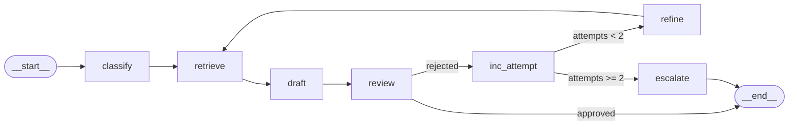

# 🎫 Support Ticket Resolution Agent

An **Agentic RAG** project built with **LangGraph**. The agent classifies a support ticket, retrieves knowledge, drafts a reply, and passes it through a **multi‑step review loop**. If two attempts fail, the ticket is **escalated** for human review.

> This repo is recruiter‑ready: LangGraph **CLI dev server** usage, clean nodes/graph wiring, Streamlit UI, tests, and optional LangSmith tracing.

---

## ✨ What’s Inside
- **Corrective RAG loop** → classify → retrieve → draft → review → (refine & retry ≤2) → escalate.  
- **LangGraph CLI dev server** (no bare checkpointing in code).  
- **Streamlit UI** to try tickets and visualize the graph.  
- **Tests** for happy path, retry, and escalation.  
- **Optional** LangSmith tracing for observability.

---

## 🧩 Agent Flow

The diagram below shows the entire pipeline. (PNG preferred; Mermaid fallback included.)

<p align="center">
  
</p>

<details>
<summary>Or view the Mermaid source (fallback)</summary>


</details>

---

## 📂 Project Structure

```
support-ticket-agent/
├─ docs/
│  ├─ agent_flow.png       # PNG diagram (screenshot or exported)
│  └─ agent_flow.mmd       # (optional) Mermaid source
├─ rag_corpus/             # Knowledge base (author/edit these)
├─ rag_index/              # (ignored) FAISS index built from rag_corpus
├─ src/
│  ├─ graph.py             # Graph wiring; checkpointer injected by runner/CLI
│  ├─ state.py             # Ticket state contract
│  └─ nodes/               # classify / retrieve / draft / review / refine / escalate
├─ tests/                  # pytest suites (happy / retry / escalate)
├─ app.py                  # Streamlit UI
├─ run_local.py            # One‑shot local runner (MemorySaver checkpointer)
├─ langgraph.json          # Config for LangGraph CLI dev server
├─ requirements.txt
└─ README.md
```

---

## ⚡ Quickstart

### 1) Setup
```bash
python -m venv .venv
# macOS/Linux
source .venv/bin/activate
# Windows (PowerShell)
.venv\Scripts\Activate.ps1

pip install -r requirements.txt
```

Create `.env` (put in repo root):
```env
# Required for embeddings & LLM
OPENAI_API_KEY=sk-...

# Optional: observability with LangSmith
LANGSMITH_API_KEY=ls-...
LANGCHAIN_TRACING_V2=true
LANGCHAIN_PROJECT=support-ticket-agent
```

### 2) Build RAG index (optional but recommended)
Put short `.md`/`.txt` notes under `rag_corpus/<Category>/`, then run:
```bash
python -m src.rag_ingest
```
> No key? Retrieval falls back to tiny built‑in snippets, so the app still runs.

### 3) Run with **LangGraph CLI dev server** ✅
This is the “CLI MeeLI” (😉) requirement from the assessment.

```bash
pip install -U langgraph-cli
langgraph dev
```
The CLI:
- loads `build_graph` from `src/graph.py` (via `langgraph.json`),
- injects a checkpointer for you,
- serves a dev UI at **http://localhost:2024**.

> **CLI vs LangSmith:** The CLI is the **runner & checkpoint host**. **LangSmith** is optional tracing/observability (see below).

### 4) Try the Streamlit UI (optional)
```bash
streamlit run app.py
```
- Fill in **Subject** and **Description**.
- See **category**, **retrieved context**, **draft**, **review feedback**, **attempts**, and escalation notice if it fails twice.
- “Agent Flow Diagram” renders Mermaid and can save `docs/agent_flow.mmd`.

### 5) One‑shot local run (script)
```bash
python run_local.py
```
Prints the final state and (optionally) exports the diagram.

### 6) Tests
```bash
pytest -q
```

---

## 🔭 Observability with LangSmith (optional)
1. Create an account at https://smith.langchain.com and generate an API key.  
2. Put these in `.env`:
   ```env
   LANGSMITH_API_KEY=ls-...
   LANGCHAIN_TRACING_V2=true
   LANGCHAIN_PROJECT=support-ticket-agent
   ```
3. Start the dev server: `langgraph dev`  
4. Run a few tickets → inspect traces in LangSmith (graph steps, inputs/outputs, retries).  
Great for debugging and screenshots in your portfolio.

---

## 🧠 Design Notes
- **Pure nodes**: each node reads from state and returns a **partial update**; LangGraph merges results.  
- **Retry logic**: after a rejection, we increment `attempts`, produce a `refine_hint`, re‑retrieve, and try again; cap at 2, then **escalate**.  
- **Escalation log**: `escalation_log.csv` is appended **only** on final failure (by design).  
- **Checkpointer**: not hard‑coded; injected by the **CLI** or `run_local.py` (MemorySaver) to stay compliant with the assessment’s constraint.

---

## 🧹 Git Hygiene
- Keep: `src/`, `rag_corpus/`, `tests/`, `docs/`, `app.py`, `run_local.py`, `langgraph.json`.  
- Ignore (add to `.gitignore`):  
  ```gitignore
  __pycache__/ .pytest_cache/ .venv/ .langgraph_api/
  .env* escalation_log.csv run_log.csv
  rag_index/                 # indexes are rebuildable artifacts
  ```

---

## ✅ Example Ticket
**Subject:** `Refund not received after subscription cancellation`  
**Description:** `I canceled last week but no refund has shown up. When will I get it?`

Expected outcome: `category: Billing`, context mentions refund policy timeline, clear draft, approved unless policy violated.

---

## 🙋 Troubleshooting
- **Image in README not showing:** ensure `docs/agent_flow.png` exists in the repo. Otherwise, the Mermaid fallback above will render.  
- **FAISS/embeddings without key:** the app runs using fallback snippets; add `OPENAI_API_KEY` to enable vector retrieval.  
- **“Checkpointer requires keys …” in scripts:** pass a `thread_id` in `config` when invoking directly; the **CLI** handles this for you.  
- **pygraphviz/Graphviz issues:** not required here; we use Mermaid for diagrams. If you want PNG export, use `mermaid-cli` or screenshot the UI.

---

